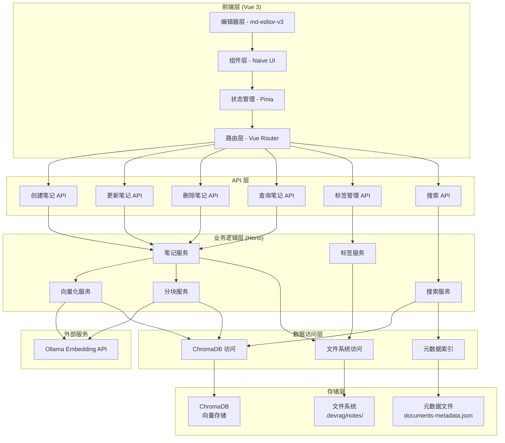
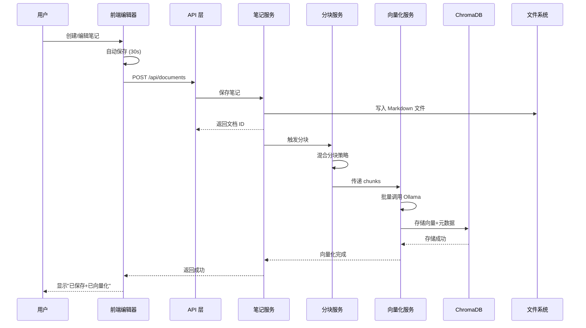
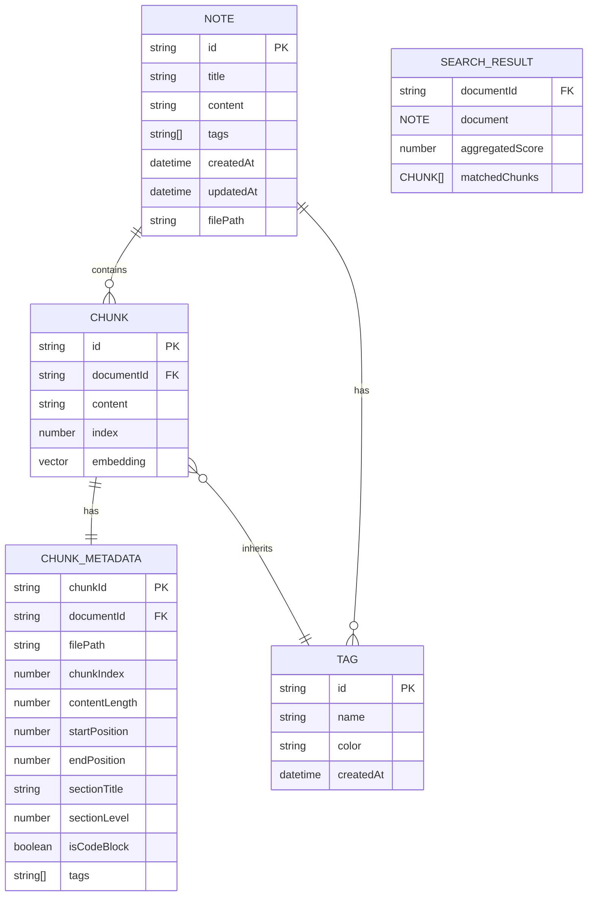
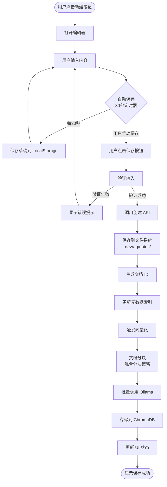
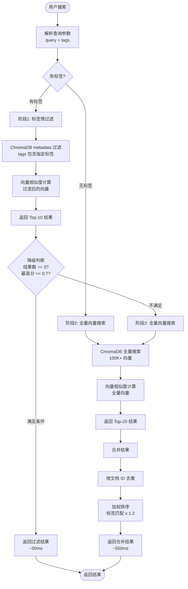
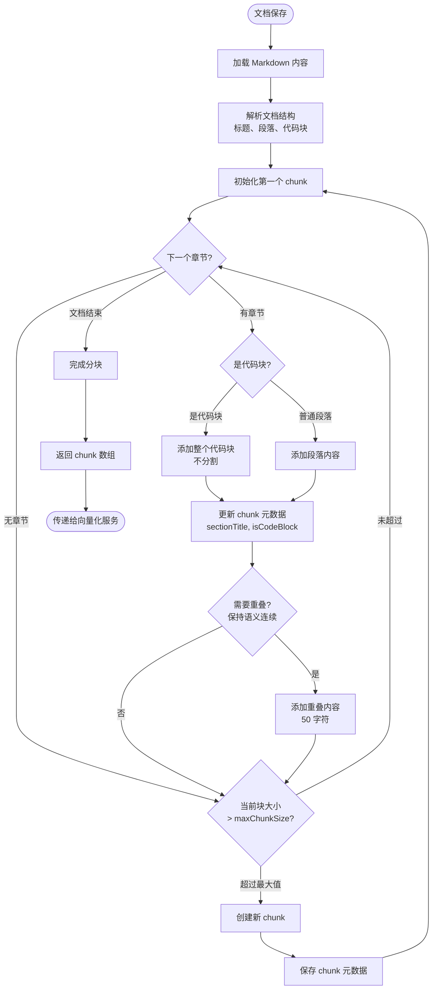
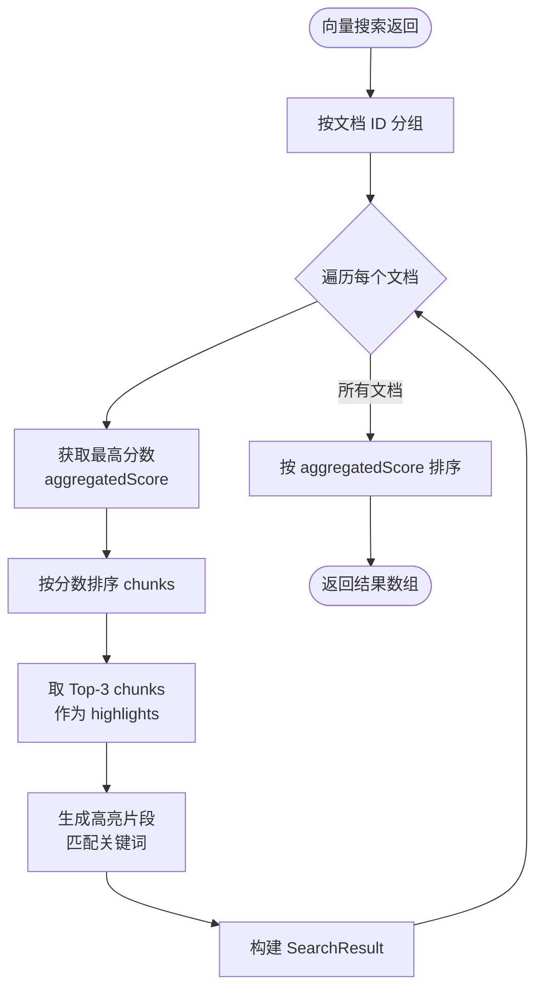

# Documents (本地笔记) 技术架构设计

| 文档版本 | 日期 | 作者 | 变更说明 |
|---------|------|------|---------|
| v1.0 | 2026-03-28 | Architect | 初始版本 |

---

## 1. 架构概览

### 1.1 系统分层图



### 1.2 核心组件

**前端核心组件**
- **DocumentsEditor**: Markdown 编辑器主组件，集成 md-editor-v3
- **DocumentsList**: 笔记列表展示组件，支持排序和筛选
- **TagsManager**: 标签管理组件，支持创建、删除、重命名
- **SearchBar**: 搜索栏组件，支持语义搜索和标签筛选
- **AutoSave**: 自动保存服务，定时保存草稿

**后端核心服务**
- **NotesService**: 笔记 CRUD 业务逻辑
- **TagsService**: 标签管理业务逻辑
- **VectorizationService**: 向量化服务，调用 Ollama API
- **ChunkingService**: 文档分块服务，实现混合分块策略
- **SearchService**: 搜索服务，实现两阶段查询 + 智能降级

**数据访问组件**
- **FileSystemStorage**: 文件系统存储访问
- **ChromaDBAdapter**: ChromaDB 访问适配器
- **MetadataIndex**: 元数据索引管理

### 1.3 数据流架构



---

## 2. 技术栈

### 2.1 前端技术栈

| 技术 | 版本 | 用途 |
|------|------|------|
| **Vue 3** | ^3.4.0 | 前端框架 |
| **TypeScript** | ^5.3.0 | 类型系统 |
| **Vite** | ^5.0.0 | 构建工具 |
| **Naive UI** | ^2.38.0 | UI 组件库 |
| **md-editor-v3** | ^4.0.0 | Markdown 编辑器 |
| **Vue Router** | ^4.2.0 | 路由管理 |
| **Pinia** | ^2.1.0 | 状态管理 |
| **Axios** | ^1.6.0 | HTTP 客户端 |

### 2.2 后端技术栈

| 技术 | 版本 | 用途 |
|------|------|------|
| **Node.js** | ^20.0.0 | 运行时 |
| **Hono** | ^3.12.0 | Web 框架 |
| **TypeScript** | ^5.3.0 | 类型系统 |
| **ChromaDB** | ^0.4.0 | 向量数据库客户端 |
| **Ollama** | ^0.5.0 | Embedding 服务客户端 |

### 2.3 存储方案

| 存储 | 类型 | 用途 |
|------|------|------|
| **文件系统** | 本地文件 | 完整 Markdown 文件存储 |
| **ChromaDB** | 向量数据库 | 向量存储和语义搜索 |
| **元数据文件** | JSON | 快速索引和元数据查询 |

### 2.4 外部服务

| 服务 | 用途 |
|------|------|
| **Ollama** | 文本向量化（Embedding） |
| **ChromaDB Server** | 向量数据库服务（Docker） |

---

## 3. 数据模型

### 3.1 实体关系图



### 3.2 核心数据结构

#### Note (笔记)

```typescript
interface Note {
  id: string;                  // 笔记唯一 ID (UUID)
  title: string;               // 笔记标题
  content: string;             // Markdown 内容
  tags: string[];              // 标签数组，如 ["javascript", "tutorial"]
  filePath: string;            // 文件路径，如 ".devrag/notes/2024-03-27-{uuid}-note.md"
  createdAt: Date;             // 创建时间
  updatedAt: Date;             // 更新时间
}
```

#### Chunk (文档分块)

```typescript
interface Chunk {
  id: string;                  // chunk 唯一 ID (UUID)
  documentId: string;          // 所属文档 ID
  content: string;             // chunk 内容
  index: number;               // chunk 序号（从 0 开始）
  embedding?: number[];        // 向量数据（可选，查询时返回）
  metadata: ChunkMetadata;     // 元数据
}
```

#### ChunkMetadata (分块元数据)

```typescript
interface ChunkMetadata {
  chunkId: string;             // chunk 唯一 ID
  documentId: string;          // 所属文档 ID
  filePath: string;            // 文件路径

  // 位置信息
  chunkIndex: number;          // chunk 序号（从 0 开始）
  startPosition: number;       // 在原文档中的起始位置
  endPosition: number;         // 在原文档中的结束位置

  // 内容信息
  contentLength: number;       // 内容长度

  // 结构信息
  sectionTitle?: string;       // 所属章节标题
  sectionLevel?: number;       // 章节层级（H1-H6）
  isCodeBlock?: boolean;       // 是否代码块

  // 标签（从文档继承）
  tags: string[];              // 标签数组
}
```

#### Tag (标签)

```typescript
interface Tag {
  id: string;                  // 标签唯一 ID
  name: string;                // 标签名称
  color?: string;              // 标签颜色（v1.1）
  createdAt: Date;             // 创建时间
}
```

#### SearchResult (搜索结果)

```typescript
interface SearchResult {
  documentId: string;          // 文档 ID
  document: Note;              // 完整文档
  aggregatedScore: number;     // 聚合分数（取最高分）
  matchedChunks: Array<{
    chunkId: string;           // chunk ID
    content: string;           // chunk 内容
    score: number;             // 相似度分数
    highlight: string;         // 高亮片段
  }>;
}
```

#### ChromaDB Metadata (向量数据库元数据)

```typescript
interface ChromaDBMetadata {
  filePath: string;            // 文件路径，用于读取完整内容
  chunkIndex: number;          // chunk 索引
  documentId: string;          // 文档 ID
  title: string;               // 笔记标题
  tags: string[];              // 多标签数组，用于预过滤查询
  createdAt: string;           // ISO 时间戳
  sectionTitle?: string;       // 章节标题
  isCodeBlock?: boolean;       // 是否代码块
}
```

### 3.3 数据存储映射

| 数据结构 | 存储位置 | 存储格式 |
|---------|---------|---------|
| Note (完整) | 文件系统 | Markdown 文件 |
| Note (元数据) | documents-metadata.json | JSON |
| Chunk (向量) | ChromaDB | 向量数组 |
| Chunk (内容) | ChromaDB | 文本 |
| Chunk (元数据) | ChromaDB metadata | JSON |
| Tag (关系) | Note.tags + ChromaDB metadata | 数组 |

---

## 4. API 设计

### 4.1 RESTful 接口列表

#### 笔记管理 API

| 方法 | 路径 | 描述 |
|------|------|------|
| POST | /api/documents | 创建笔记 |
| PUT | /api/documents/:id | 更新笔记 |
| DELETE | /api/documents/:id | 删除笔记 |
| GET | /api/documents/:id | 获取笔记详情 |
| GET | /api/documents | 获取笔记列表 |
| POST | /api/documents/:id/vectorize | 手动触发向量化 |

#### 标签管理 API

| 方法 | 路径 | 描述 |
|------|------|------|
| GET | /api/tags | 获取所有标签 |
| POST | /api/tags | 创建标签 |
| PUT | /api/tags/:id | 更新标签 |
| DELETE | /api/tags/:id | 删除标签 |
| GET | /api/tags/:id/documents | 获取标签下的笔记 |

#### 搜索 API

| 方法 | 路径 | 描述 |
|------|------|------|
| POST | /api/search | 语义搜索 |
| GET | /api/search/suggest | 搜索建议 |

### 4.2 详细接口定义

#### 4.2.1 创建笔记

**请求**
```http
POST /api/documents
Content-Type: application/json

{
  "title": "React Hooks 使用指南",
  "content": "# React Hooks\n\nReact Hooks 是...",
  "tags": ["react", "javascript", "frontend"]
}
```

**响应**
```http
HTTP/1.1 201 Created
Content-Type: application/json

{
  "success": true,
  "data": {
    "id": "550e8400-e29b-41d4-a716-446655440000",
    "title": "React Hooks 使用指南",
    "content": "# React Hooks\n\nReact Hooks 是...",
    "tags": ["react", "javascript", "frontend"],
    "filePath": ".devrag/notes/2024-03-28-550e8400-react-hooks.md",
    "createdAt": "2024-03-28T10:30:00Z",
    "updatedAt": "2024-03-28T10:30:00Z"
  },
  "vectorization": {
    "status": "pending",
    "message": "向量化已启动，预计 3 秒完成"
  }
}
```

#### 4.2.2 更新笔记

**请求**
```http
PUT /api/documents/550e8400-e29b-41d4-a716-446655440000
Content-Type: application/json

{
  "title": "React Hooks 完全指南",
  "content": "# React Hooks\n\nReact Hooks 是...",
  "tags": ["react", "javascript", "frontend", "tutorial"]
}
```

**响应**
```http
HTTP/1.1 200 OK
Content-Type: application/json

{
  "success": true,
  "data": {
    "id": "550e8400-e29b-41d4-a716-446655440000",
    "title": "React Hooks 完全指南",
    "content": "# React Hooks\n\nReact Hooks 是...",
    "tags": ["react", "javascript", "frontend", "tutorial"],
    "filePath": ".devrag/notes/2024-03-28-550e8400-react-hooks.md",
    "createdAt": "2024-03-28T10:30:00Z",
    "updatedAt": "2024-03-28T11:00:00Z"
  },
  "vectorization": {
    "status": "pending",
    "message": "重新向量化已启动"
  }
}
```

#### 4.2.3 删除笔记

**请求**
```http
DELETE /api/documents/550e8400-e29b-41d4-a716-446655440000
```

**响应**
```http
HTTP/1.1 200 OK
Content-Type: application/json

{
  "success": true,
  "message": "笔记已删除",
  "deletedChunks": 15
}
```

#### 4.2.4 获取笔记列表

**请求**
```http
GET /api/documents?tags=react,javascript&sort=updatedAt&order=desc&page=1&limit=20
```

**响应**
```http
HTTP/1.1 200 OK
Content-Type: application/json

{
  "success": true,
  "data": {
    "total": 45,
    "page": 1,
    "limit": 20,
    "documents": [
      {
        "id": "550e8400-e29b-41d4-a716-446655440000",
        "title": "React Hooks 完全指南",
        "tags": ["react", "javascript", "frontend"],
        "createdAt": "2024-03-28T10:30:00Z",
        "updatedAt": "2024-03-28T11:00:00Z",
        "excerpt": "React Hooks 是 React 16.8 引入的新特性..."
      }
    ]
  }
}
```

#### 4.2.5 语义搜索

**请求**
```http
POST /api/search
Content-Type: application/json

{
  "query": "React useEffect 依赖数组优化",
  "tags": ["react"],
  "limit": 10
}
```

**响应**
```http
HTTP/1.1 200 OK
Content-Type: application/json

{
  "success": true,
  "query": "React useEffect 依赖数组优化",
  "strategy": "hybrid",  // "filtered" | "hybrid" | "full"
  "data": {
    "total": 10,
    "results": [
      {
        "documentId": "550e8400-e29b-41d4-a716-446655440000",
        "document": {
          "id": "550e8400-e29b-41d4-a716-446655440000",
          "title": "React Hooks 完全指南",
          "tags": ["react", "javascript"],
          "filePath": ".devrag/notes/2024-03-28-550e8400-react-hooks.md"
        },
        "aggregatedScore": 0.88,
        "matchedChunks": [
          {
            "chunkId": "chunk_001",
            "content": "useEffect 的依赖数组优化...",
            "score": 0.88,
            "highlight": "useEffect 的<em>依赖数组优化</em>是性能优化的关键..."
          }
        ]
      }
    ]
  },
  "meta": {
    "stage1Results": 10,
    "stage2Triggered": false,
    "totalTime": 52
  }
}
```

#### 4.2.6 获取所有标签

**请求**
```http
GET /api/tags
```

**响应**
```http
HTTP/1.1 200 OK
Content-Type: application/json

{
  "success": true,
  "data": {
    "total": 25,
    "tags": [
      {
        "id": "tag_001",
        "name": "react",
        "count": 15
      },
      {
        "id": "tag_002",
        "name": "javascript",
        "count": 32
      }
    ]
  }
}
```

#### 4.2.7 创建标签

**请求**
```http
POST /api/tags
Content-Type: application/json

{
  "name": "typescript",
  "color": "#3178c6"
}
```

**响应**
```http
HTTP/1.1 201 Created
Content-Type: application/json

{
  "success": true,
  "data": {
    "id": "tag_003",
    "name": "typescript",
    "color": "#3178c6",
    "createdAt": "2024-03-28T12:00:00Z"
  }
}
```

#### 4.2.8 更新标签

**请求**
```http
PUT /api/tags/tag_001
Content-Type: application/json

{
  "name": "reactjs",
  "color": "#61dafb"
}
```

**响应**
```http
HTTP/1.1 200 OK
Content-Type: application/json

{
  "success": true,
  "data": {
    "id": "tag_001",
    "name": "reactjs",
    "color": "#61dafb",
    "updatedAt": "2024-03-28T12:05:00Z"
  },
  "updatedDocuments": 15
}
```

#### 4.2.9 删除标签

**请求**
```http
DELETE /api/tags/tag_001
```

**响应**
```http
HTTP/1.1 200 OK
Content-Type: application/json

{
  "success": true,
  "message": "标签已删除",
  "updatedDocuments": 15
}
```

---

## 5. 核心流程

### 5.1 创建笔记流程



### 5.2 混合查询策略流程



### 5.3 混合分块策略流程



### 5.4 搜索结果合并流程



---

## 6. 安全设计

### 6.1 认证授权

**MVP 阶段**
- 本地单用户场景，无需认证
- 所有 API 无需 Token 验证

**后续版本（v1.2+）**
- 添加 JWT 认证机制
- 支持多用户权限控制
- 笔记访问权限管理

### 6.2 数据加密

**传输加密**
- 所有 API 通信使用 HTTPS（生产环境）
- WebSocket 通信使用 WSS

**存储加密**
- LocalStorage 草稿数据可选加密（使用 AES-256）
- 文件系统存储可选加密（用户配置）

**加密实现**
```typescript
// 草稿数据加密示例
import CryptoJS from 'crypto-js';

const SECRET_KEY = userConfig.encryptionKey;

function encryptDraft(content: string): string {
  return CryptoJS.AES.encrypt(content, SECRET_KEY).toString();
}

function decryptDraft(encrypted: string): string {
  const bytes = CryptoJS.AES.decrypt(encrypted, SECRET_KEY);
  return bytes.toString(CryptoJS.enc.Utf8);
}
```

### 6.3 输入验证

**XSS 防护**
- Markdown 渲染使用 DOMPurify 过滤
- 禁止 `<script>` 等危险标签
- CSP（Content Security Policy）策略

**实现示例**
```typescript
import DOMPurify from 'dompurify';

// 渲染 Markdown 前
function sanitizeMarkdown(html: string): string {
  return DOMPurify.sanitize(html, {
    ALLOWED_TAGS: ['p', 'h1', 'h2', 'h3', 'strong', 'em', 'code', 'pre'],
    ALLOWED_ATTR: ['class', 'id']
  });
}
```

**CSRF 防护**
- 所有修改操作使用 POST/PUT/DELETE
- 添加 CSRF Token（后续版本）

**SQL 注入防护**
- 使用 ChromaDB 官方客户端，参数化查询
- 不直接拼接 SQL 字符串

### 6.4 文件系统安全

**路径遍历防护**
```typescript
import path from 'path';

function validateFilePath(filePath: string): boolean {
  const normalized = path.normalize(filePath);
  const notesDir = path.resolve('.devrag/notes/');

  // 确保路径在 notes 目录下
  return normalized.startsWith(notesDir);
}
```

**文件大小限制**
- 单个笔记最大 10MB
- 超过限制时提示用户分档

---

## 7. 性能优化

### 7.1 缓存策略

**前端缓存**
```typescript
// Pinia 状态管理缓存
interface DocumentsCache {
  documents: Map<string, Note>;      // 文档缓存
  tags: Tag[];                       // 标签缓存
  searchResults: Map<string, SearchResult[]>; // 搜索结果缓存
  timestamp: number;                 // 缓存时间戳
}

// 缓存策略
const CACHE_TTL = 5 * 60 * 1000; // 5 分钟

function getFromCache<T>(key: string, cache: Map<string, {data: T, timestamp: number}>): T | null {
  const cached = cache.get(key);
  if (!cached) return null;

  const isExpired = Date.now() - cached.timestamp > CACHE_TTL;
  return isExpired ? null : cached.data;
}
```

**后端缓存**
```typescript
// 元数据缓存
class MetadataCache {
  private cache: Map<string, NoteMetadata>;
  private ttl: number = 60000; // 1 分钟

  get(documentId: string): NoteMetadata | null {
    const cached = this.cache.get(documentId);
    if (!cached) return null;

    const isExpired = Date.now() - cached.timestamp > this.ttl;
    return isExpired ? null : cached.data;
  }

  set(documentId: string, metadata: NoteMetadata): void {
    this.cache.set(documentId, {
      data: metadata,
      timestamp: Date.now()
    });
  }
}
```

### 7.2 向量搜索优化

**索引优化**
- ChromaDB 使用 HNSW 索引
- 配置合适的索引参数

```typescript
// ChromaDB 集合配置
const collectionConfig = {
  name: 'documents',
  metadata: {
    'hnsw:space': 'cosine',
    'hnsw:construction_ef': 200,
    'hnsw:M': 16
  }
};
```

**批量操作**
```typescript
// 批量向量化
async function batchVectorize(chunks: Chunk[]): Promise<void> {
  const batchSize = 10;
  for (let i = 0; i < chunks.length; i += batchSize) {
    const batch = chunks.slice(i, i + batchSize);
    const embeddings = await Promise.all(
      batch.map(chunk => ollama.embed(chunk.content))
    );

    await chromaDB.add({
      ids: batch.map(c => c.id),
      embeddings: embeddings,
      metadatas: batch.map(c => c.metadata)
    });
  }
}
```

### 7.3 前端优化

**虚拟滚动**
```vue
<template>
  <VirtualList
    :items="documents"
    :item-height="80"
    :height="600"
  >
    <template #default="{ item }">
      <DocumentItem :document="item" />
    </template>
  </VirtualList>
</template>
```

**懒加载**
```typescript
// 图片懒加载


// 初始化
document.addEventListener('DOMContentLoaded', () => {
  const lazyImages = document.querySelectorAll('img.lazyload');
  // 使用 Intersection Observer
});
```

**代码分割**
```typescript
// 路由懒加载
const routes = [
  {
    path: '/documents',
    component: () => import('@/views/Documents.vue')
  },
  {
    path: '/documents/:id',
    component: () => import('@/views/DocumentsEditor.vue')
  }
];
```

### 7.4 数据库优化

**连接池**
```typescript
// ChromaDB 连接池
class ChromaDBPool {
  private clients: ChromaClient[] = [];
  private maxConnections: number = 5;

  async getClient(): Promise<ChromaClient> {
    if (this.clients.length < this.maxConnections) {
      const client = new ChromaClient();
      this.clients.push(client);
      return client;
    }

    // 复用现有连接
    return this.clients[0];
  }
}
```

**查询优化**
```typescript
// 预过滤优化
async function searchWithFilter(query: string, tags: string[]): Promise<SearchResult[]> {
  // 使用 metadata 预过滤
  const results = await chromaDB.query({
    queryEmbeddings: await embed(query),
    nResults: 10,
    where: {
      tags: { $in: tags }  // ChromaDB 过滤语法
    }
  });

  return results;
}
```

---

## 8. 部署方案

### 8.1 环境配置

**开发环境**
```bash
# .env.development
VITE_API_BASE_URL=http://localhost:3000
VITE_OLLAMA_URL=http://localhost:11434
VITE_CHROMADB_URL=http://localhost:8000
```

**生产环境**
```bash
# .env.production
VITE_API_BASE_URL=https://api.local-rag.com
VITE_OLLAMA_URL=http://localhost:11434
VITE_CHROMADB_URL=http://localhost:8000
```

### 8.2 Docker Compose 部署

```yaml
# docker-compose.yml
version: '3.8'

services:
  # 后端服务
  backend:
    build: ./backend
    ports:
      - "3000:3000"
    volumes:
      - ./data:/app/.devrag
    environment:
      - NODE_ENV=production
      - OLLAMA_URL=http://ollama:11434
      - CHROMADB_URL=http://chromadb:8000
    depends_on:
      - chromadb
      - ollama

  # ChromaDB 向量数据库
  chromadb:
    image: chromadb/chroma:latest
    ports:
      - "8000:8000"
    volumes:
      - chromadb-data:/chroma/chroma
    environment:
      - CHROMA_SERVER_HOST=0.0.0.0
      - CHROMA_SERVER_PORT=8000

  # Ollama Embedding 服务
  ollama:
    image: ollama/ollama:latest
    ports:
      - "11434:11434"
    volumes:
      - ollama-data:/root/.ollama
    environment:
      - OLLAMA_HOST=0.0.0.0

  # 前端服务
  frontend:
    build: ./frontend
    ports:
      - "80:80"
    depends_on:
      - backend

volumes:
  chromadb-data:
  ollama-data:
```

### 8.3 部署流程

**1. 构建前端**
```bash
cd frontend
npm run build
# 生成 dist/ 目录
```

**2. 构建后端**
```bash
cd backend
npm run build
# 生成 dist/ 目录
```

**3. 启动服务**
```bash
# 启动所有服务
docker-compose up -d

# 查看日志
docker-compose logs -f

# 停止服务
docker-compose down
```

**4. 初始化 ChromaDB**
```bash
# 进入 backend 容器
docker-compose exec backend sh

# 运行初始化脚本
npm run init-chromadb
```

### 8.4 健康检查

**后端健康检查**
```typescript
// /health 端点
app.get('/health', async (c) => {
  const checks = {
    backend: true,
    filesystem: await checkFileSystem(),
    chromadb: await checkChromaDB(),
    ollama: await checkOllama()
  };

  const isHealthy = Object.values(checks).every(v => v === true);

  return c.json({
    status: isHealthy ? 'healthy' : 'unhealthy',
    checks
  }, isHealthy ? 200 : 503);
});
```

**Docker 健康检查**
```yaml
services:
  backend:
    healthcheck:
      test: ["CMD", "curl", "-f", "http://localhost:3000/health"]
      interval: 30s
      timeout: 10s
      retries: 3
      start_period: 40s
```

---

## 9. ADR（架构决策记录）

| 决策 | 背景 | 方案 | 权衡 |
|------|------|------|------|
| **D1: Markdown 编辑器选型** | 需要集成 Vue 3 原生的 Markdown 编辑器 | 选择 **md-editor-v3** 而非 TipTap | ✅ Vue 3 原生支持<br>✅ 开箱即用<br>✅ 中文文档<br>❌ 定制化能力弱于 TipTap |
| **D2: 存储架构** | 需要存储笔记文件和向量数据 | 选择**文件路径关联 + ChromaDB** 而非 SQLite | ✅ 架构简单<br>✅ 原生可编辑<br>✅ Git 友好<br>❌ 大文件读取性能略低 |
| **D3: 查询策略** | 需要兼顾性能和召回率 | 选择**混合查询策略**（两阶段 + 智能降级） | ✅ 性能优先（50ms）<br>✅ 兜底保障（100% 召回）<br>❌ 实现复杂度高 |
| **D4: 分块策略** | 需要保持语义完整性和搜索质量 | 选择**混合分块策略**（按结构 + 控制大小） | ✅ 语义完整<br>✅ 代码友好<br>✅ 实现适中<br>❌ 需要 Markdown 适配 |
| **D5: 自动保存时机** | 需要平衡实时性和性能 | 选择**定时自动保存**（30 秒） | ✅ 简单可靠<br>❌ 可能丢失最后输入 |
| **D6: 向量化时机** | 需要不阻塞用户操作 | 选择**保存后异步向量化** | ✅ 不阻塞编辑<br>❌ 搜索有短暂延迟 |
| **D7: 标签存储** | 需要支持多标签和高效查询 | 选择**ChromaDB metadata + 文件系统** 双存储 | ✅ 查询高效（10-100 倍提升）<br>✅ 支持预过滤<br>❌ 需要同步更新 |

---

## 10. 附录

### 10.1 Mermaid 图表说明

本文档使用 Mermaid 语法绘制以下图表：
- 系统分层图（Graph）
- 数据流时序图（Sequence Diagram）
- 实体关系图（ER Diagram）
- 业务流程图（Flowchart）

### 10.2 关键技术指标

| 指标 | 目标值 | 备注 |
|------|--------|------|
| 编辑器加载时间 | < 1 秒 | 首次加载 |
| 自动保存延迟 | < 500ms | 30 秒定时 |
| 向量化延迟 | < 3 秒 | 异步执行 |
| 搜索响应时间 | 50-550ms | 混合策略 |
| 标签过滤性能 | 提升 10-100 倍 | vs 全量搜索 |
| 分块平均大小 | 500 字符 | 可配置 |
| 分块重叠大小 | 50 字符 | 保持语义 |

### 10.3 关键配置参数

```typescript
// 分块配置
const CHUNK_CONFIG = {
  chunkSize: 500,           // 目标大小（字符）
  overlap: 50,              // 重叠大小（字符）
  minChunkSize: 100,        // 最小块大小
  maxChunkSize: 1000,       // 最大块大小
  delimiters: [             // 分隔符优先级
    /^#{1,6}\s+/m,         // 标题
    /\n\n/,                // 空行
    /^\s*[-*+]\s+/m        // 列表
  ],
  preserveCodeBlocks: true  // 代码块不分割
};

// 搜索配置
const SEARCH_CONFIG = {
  defaultLimit: 10,         // 默认返回结果数
  stage1Limit: 10,          // 阶段1 返回结果数
  stage2Limit: 20,          // 阶段2 返回结果数
  fallbackThreshold: 3,     // 降级触发：最小结果数
  scoreThreshold: 0.7,      // 降级触发：最低分数
  filteredBoost: 1.2,       // 过滤结果加权
  overlap: 50               // 高亮片段重叠
};

// 缓存配置
const CACHE_CONFIG = {
  documents: {
    ttl: 5 * 60 * 1000,     // 5 分钟
    maxSize: 100            // 最大缓存数
  },
  tags: {
    ttl: 10 * 60 * 1000,    // 10 分钟
    maxSize: 50
  },
  search: {
    ttl: 2 * 60 * 1000,     // 2 分钟
    maxSize: 20
  }
};
```

---

**文档结束**
